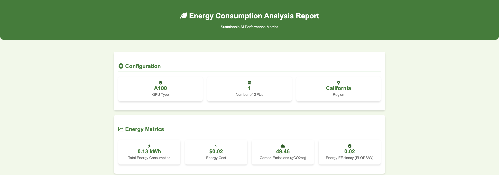
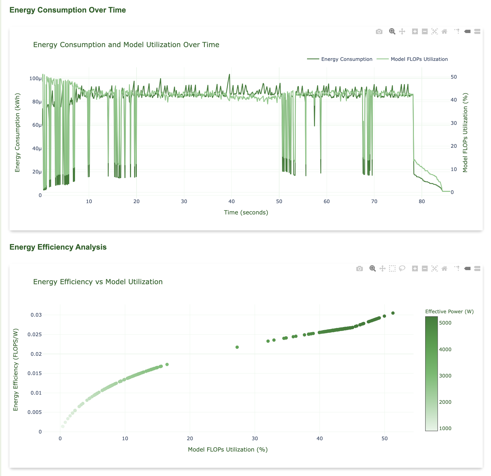
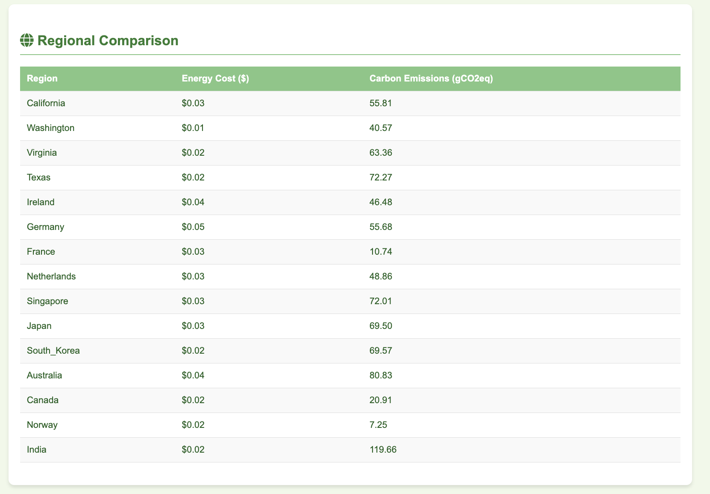
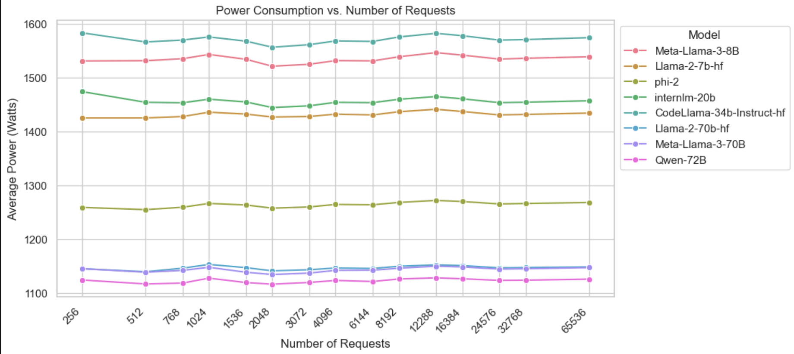
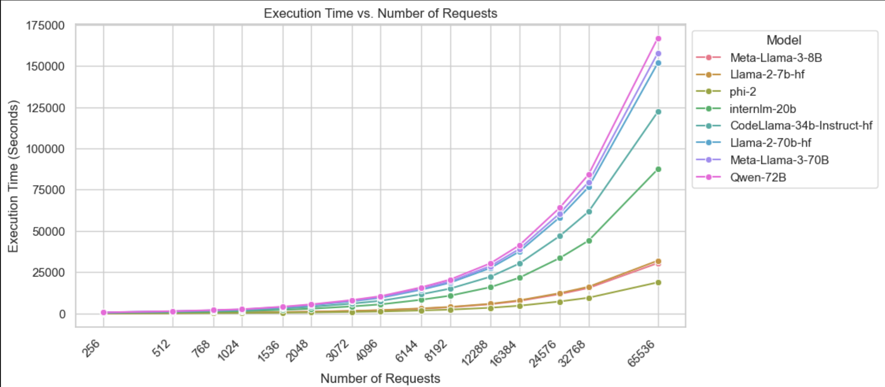
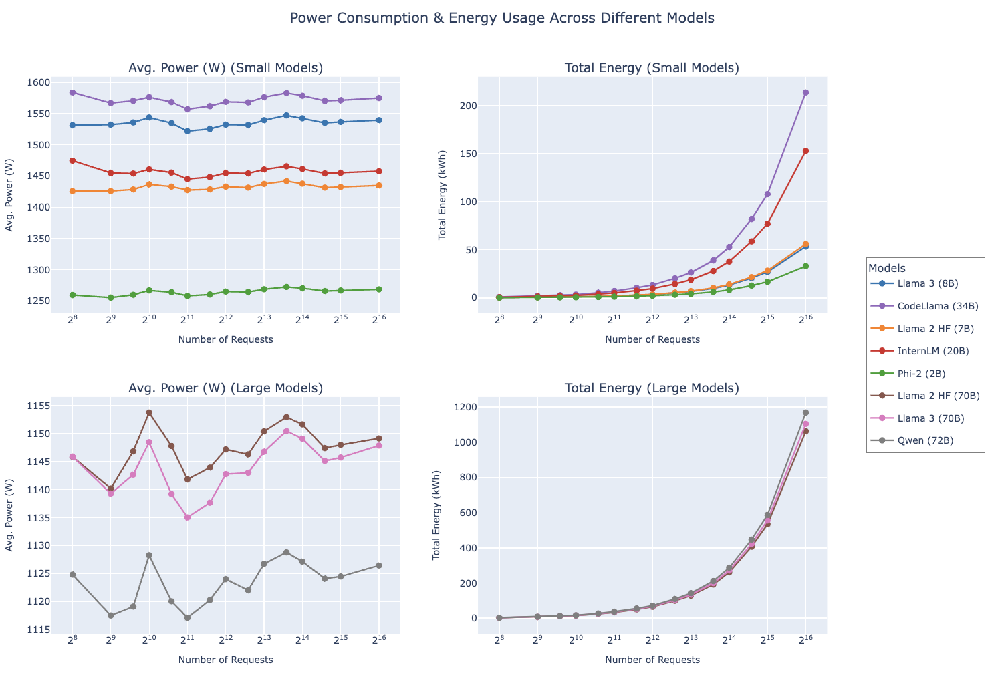
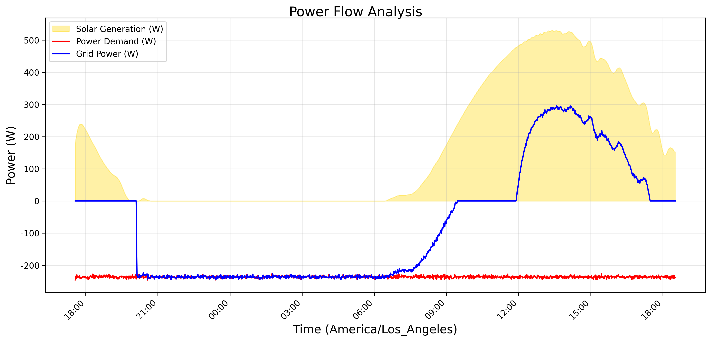
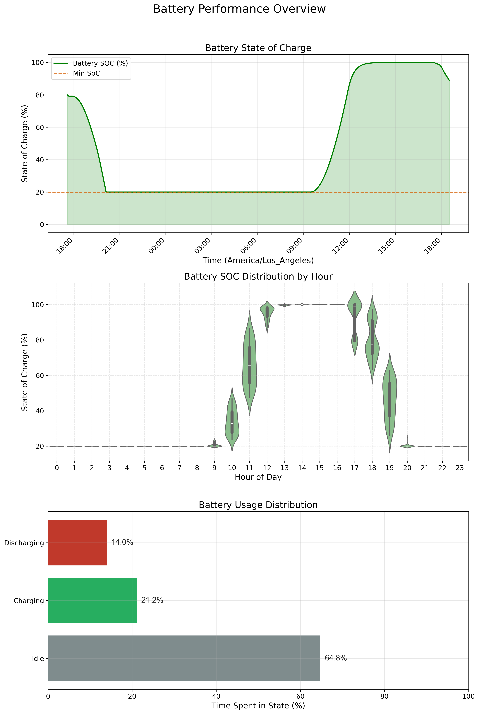
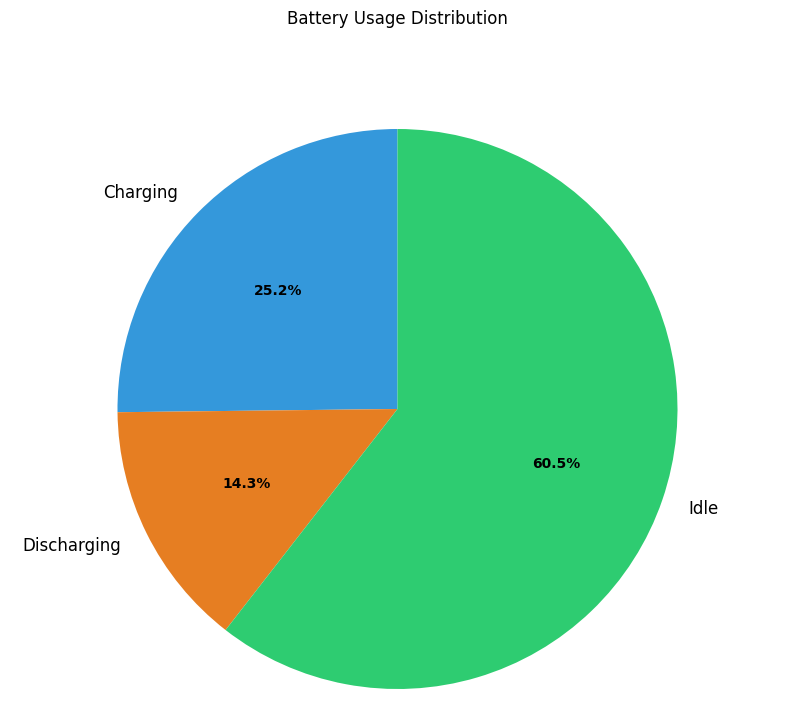
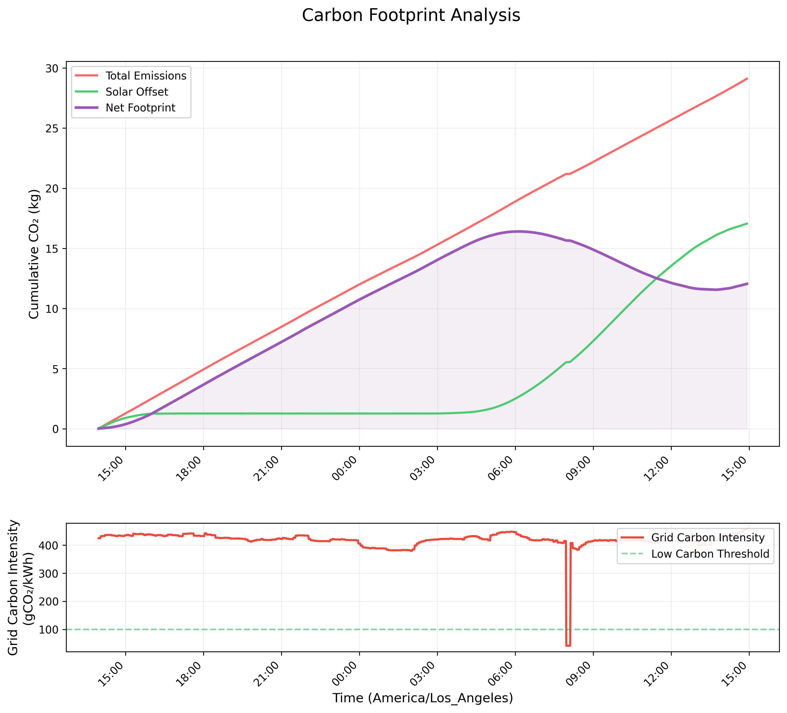

# 📗 **Vidur-Energy: Extending Vidur for Power and Energy Tracking in LLM Inference**  

Vidur-Energy is an **enhanced version** of [Vidur](https://github.com/microsoft/vidur), a high-fidelity **LLM inference system simulator**, with **additional energy tracking capabilities**. This extension introduces:  

⚡ **Power draw monitoring**  
🔋 **Energy consumption analysis**  
🌍 **Carbon emission estimation**  

These features enable **more sustainable AI inference optimizations**. 🌱🌎  

---

## 🌟 **Features**  

Vidur-Energy retains all core functionalities of Vidur while adding **new energy-aware insights**, such as:  

✅ **Power Tracking**: Extracts **GPU power draw** at different utilization levels.  
✅ **Energy Consumption Estimation**: Tracks **energy usage** across inference workloads.  
✅ **Preliminary Carbon Footprint Estimation**: Uses **grid carbon intensity data** to estimate **inference-related emissions**.  
✅ **Modular Energy Tracking**: A more **configurable** and **extensible** approach to tracking energy metrics.  
✅ **Full Compatibility with Vidur**: All existing **simulation capabilities** remain **unchanged**.  

---

## 🔧 **1. Setup**  

### 🐍 **Using `mamba` (Recommended)**  
```sh
mamba env create -p ./env -f ./environment.yml
mamba env update -f environment-dev.yml
```

### 🐍 **Using `venv`**  
```sh
python3.10 -m venv .venv
source .venv/bin/activate
python -m pip install -r requirements.txt
```

### 🐍 **Using `conda` (Least Recommended)**  
```sh
conda env create -p ./env -f ./environment.yml
conda env update -f environment-dev.yml
```

---

## 🚀 **2. Running the Simulator**  

### **Running a Standard Simulation**  
To execute a standard simulation (**without energy tracking**):  
```sh
python -m vidur.main
```
Example simulation run with extended parameters, synthetic request generator:
```sh
python -m vidur.main  \
--replica_config_device a100 \
--replica_config_model_name meta-llama/Llama-2-7b-hf \
--cluster_config_num_replicas 1 \
--replica_config_tensor_parallel_size 1 \
--replica_config_num_pipeline_stages 1 \
--request_generator_config_type synthetic \
--synthetic_request_generator_config_num_requests 400000 \
--length_generator_config_type zipf \
--interval_generator_config_type poisson \
--poisson_request_interval_generator_config_qps 20 \
--replica_scheduler_config_type vllm \
--vllm_scheduler_config_batch_size_cap 128 \
--vllm_scheduler_config_max_tokens_in_batch 4096 \
--metrics_config_store_utilization_metrics \
--execution_time_predictor_config_type random_forrest
```

Example simulation run with extended parameters, trace files:
```sh
python -m vidur.main  \
--replica_config_device a100 \
--replica_config_model_name meta-llama/Meta-Llama-3-8B \
--cluster_config_num_replicas 1 \
--replica_config_tensor_parallel_size 1 \
--replica_config_num_pipeline_stages 1 \
--request_generator_config_type synthetic \
--synthetic_request_generator_config_num_requests 512  \
--length_generator_config_type trace \
--trace_request_length_generator_config_max_tokens 16384 \
--trace_request_length_generator_config_trace_file ./data/processed_traces/splitwise_conv.csv \
--interval_generator_config_type poisson \
--poisson_request_interval_generator_config_qps 6.45 \
--replica_scheduler_config_type sarathi  \
--sarathi_scheduler_config_batch_size_cap 512  \
--sarathi_scheduler_config_chunk_size 512 \
--random_forrest_execution_time_predictor_config_prediction_max_prefill_chunk_size 16384 \
--random_forrest_execution_time_predictor_config_prediction_max_batch_size 512 \
--random_forrest_execution_time_predictor_config_prediction_max_tokens_per_request 16384
```

---

## 🌿 **3. Energy Tracking in `energy-tracking` Branch**  

The `energy-tracking` branch introduces **power and energy-related analytics** within Vidur. This branch features:  

📊 **Energy-aware statistics extraction**  
📉 **A reporting module for power consumption, energy efficiency, and carbon footprint**  

### 🔄 **Changes in This Branch**  
- **New Scripts**:  
  - `stats_extractor_energy.py`: Extracts **power, energy, and carbon footprint** metrics.  
  - `stats_extractor_energy_reporting/`: Directory for **configurations and reporting tools**.  

- **Configuration Additions**:  
  - `config/gpu_configs.py`: Defines **power profiles** for different GPU models.  
  - `config/region_configs.py`: Provides **grid parameters** like carbon intensity, PUE, and electricity cost.  

### 🌱 **Running Energy Tracking & Analysis**  

#### 📊 **Extracting Energy Metrics from a Simulation**  
Let's assume the name of our simulation result subdirectory is 'vidur-results-demo.'
```sh
python -m vidur.config_optimizer.analyzer.stats_extractor_energy \
--sim-results-dir simulator_output/vidur-results-demo
```
📁 This generates an **`analysis/` subdirectory** containing energy usage statistics.  

#### 📄 **Generating Energy Reports**  
```sh
python -m vidur.config_optimizer.analyzer.stats_extractor_energy_reporting \
--sim-results-dir simulator_output/vidur-results-demo  \
--region california
```
This generates **visual reports** on:  
✅ **Power and energy usage over time**  
✅ **Carbon emissions impact per region**  
✅ **Model parallelism efficiency vs energy consumption**  
✅ **Comparative energy costs across regions**  

---

### 📊 **Energy Consumption Analysis Report**  

🌍 **Sustainable AI Performance Metrics**  

  

### 📉 **Energy Consumption Over Time & Efficiency Analysis**  

  

### 🌍 **Regional Comparison of Carbon Emissions & Energy Costs**  

  

---

## 🧪 **4. Experiments in `experiments` Branch**  

The `experiments` branch contains **scripted experiments** analyzing:  
⚡ **Power consumption**  
⏳ **Execution time**  
🌱 **Energy efficiency in LLM inference**  

### 📂 **Structure of the Experiments Directory**  

- `experiments-revised-full-draft/scripts/`  
  - **Predefined experiment scripts**  
  - Example: `exp1-numrequests-power-energy.py` → **Evaluates power usage across different request loads.**  

- `experiments-revised-full-draft/analysis/`  
  - **Jupyter Notebooks for post-processing & visualization**  
  - Example: `exp1-numrequests-power-energy.ipynb` → **Generates power & efficiency graphs.**  

### **🔬 Running an Experiment**  

1️⃣ **Execute an experiment script**  
```sh
python experiments-revised-full-draft/scripts/exp1-numrequests-power-energy.py
```
2️⃣ **Analyze & visualize results**  
```sh
jupyter notebook experiments-revised-full-draft/analysis/exp1-numrequests-power-energy.ipynb
```

### 📊 **Experimental Results**  

#### ⚡ **Power Consumption vs. Number of Requests**  
  

#### ⏳ **Execution Time vs. Number of Requests**  
  

#### 🌱 **Comparative Energy Efficiency Across Models**  
  

---

## 🔋 **5. Vidur-Vessim Co-Simulation (`vidur-vessim-basic` Branch)**  

This branch **integrates Vidur with Vessim**, enabling:  
🔆 **Solar energy modeling**  
🔋 **Battery storage behavior tracking**  
🌍 **Carbon emissions monitoring**  

⚠️ Please create a new virtual environment and install Vidur + Vessim requirements to work on this branch. Run your Vidur simulations first, and later run Vessim on your simulations' subdirectories. This step is crucial to handle the numpy version incompatibility between Vidur and Vessim. 

### **🌞 Running Vidur-Vessim Co-Simulation (Example):**  
Let's assume the name of our simulation result subdirectory is 'vidur-vessim-example-demo.'
```sh
python -m vidur.vidur_vessim.cli \
--vidur-sim-dir simulator_output/vidur-vessim-example-demo \
--location "San Francisco" \
--agg-freq 1min \
--analysis-type "trend analysis" \
--step-size 60 \
--solar-scale-factor 6000 \
--battery-capacity 1000 \
--battery-initial-soc 0.8 \
--battery-min-soc 0.2 \
--log-metrics
```

### 📊 **Generated Reports**  

- 🔄 **Power Flow Analysis**  
    

- 🔋 **Battery SOC**  
    

- 📉 **Battery Usage Distribution**  
    

- 🌍 **Carbon Emissions Analysis**  
    

- 📁 **Simulation Metrics Summary**  
  `simulation_metrics.txt` includes performance metrics.  

---

## 🔄 **6. Formatting Code**  

To format the code:  
```sh
make format
```

---

## 🤝 **7. Contributing**  

We welcome contributions to extend **Vidur-Energy**! 🎉  

🔹 **Fork the repository**  
🔹 **Create a new branch**  
🔹 **Submit a pull request**  

---

## 🙌 **8. Acknowledgments**  

### 🌿 **Built on Microsoft Research’s Vidur**  
This project builds on **Vidur**, originally developed by Microsoft Research. Our modifications enhance its sustainability features while preserving **high-fidelity inference simulation capabilities**.  

For more details, visit the **[Vidur paper (MLSys'24)](https://arxiv.org/abs/2405.05465).**  

### ⚡ **Powered by Vessim**  
Vidur-Energy **integrates Vessim**, a testbed for **carbon-aware applications and systems**, developed by TU Berlin’s **Distributed and Operating Systems Group**.  

If you use Vessim in your research, please cite:  
📝 **Wiesner et al. (2024). Vessim: A Testbed for Carbon-Aware Applications and Systems.**  

📄 **[Read more about Vessim](https://github.com/dos-group/vessim)**  

---

## 📜 **9. License**  

Vidur-Energy follows the **original Vidur license**. Please review [`LICENSE`](./LICENSE) for details.  

🚀 **Happy Sustainable AI Computing!** 🌱
