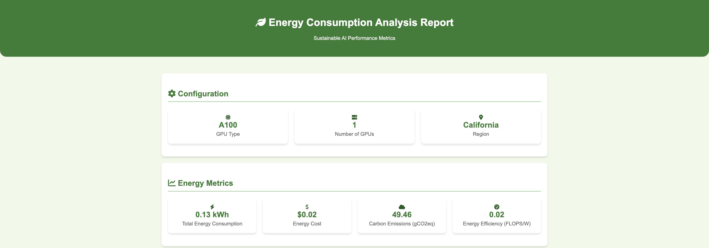
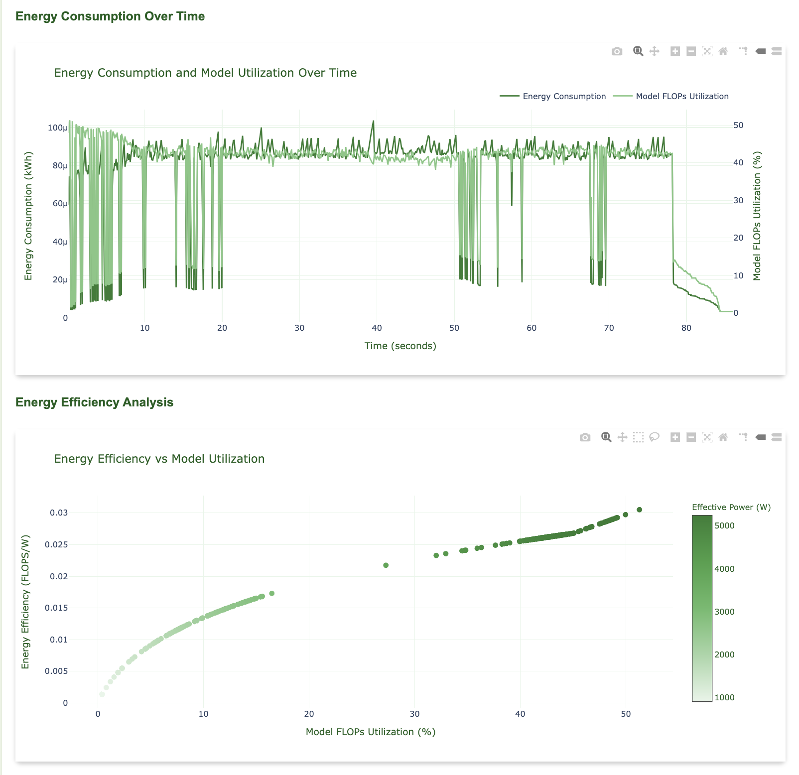
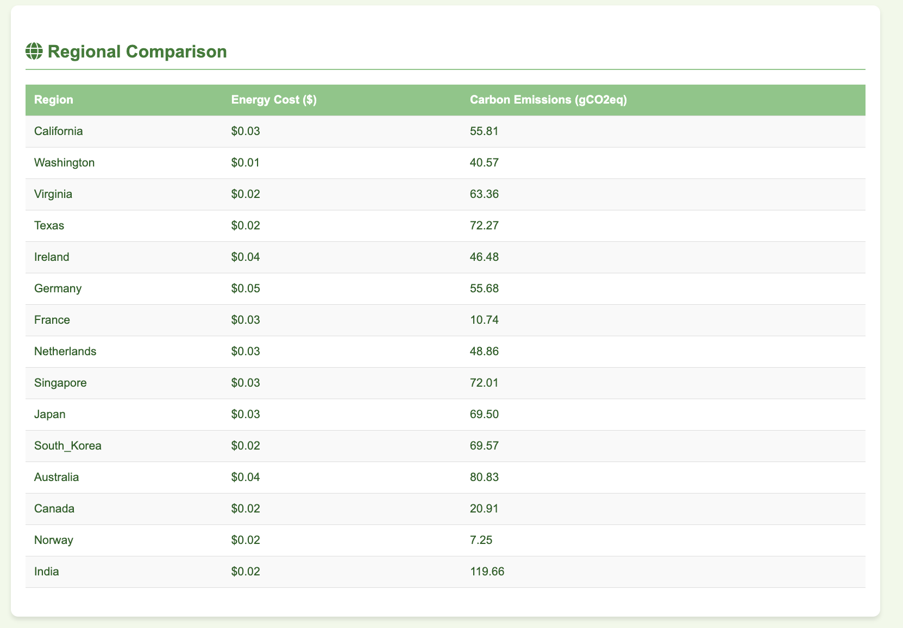
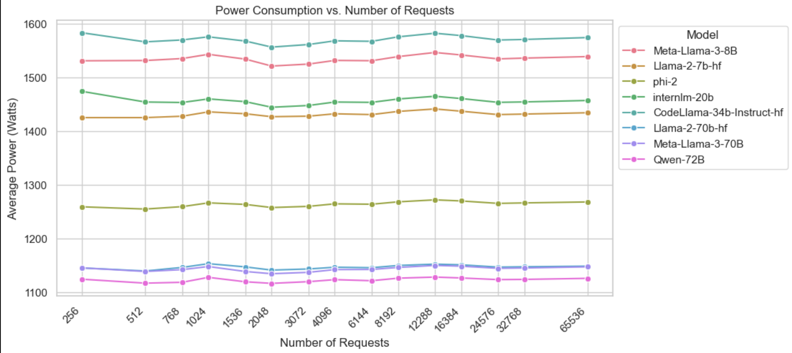
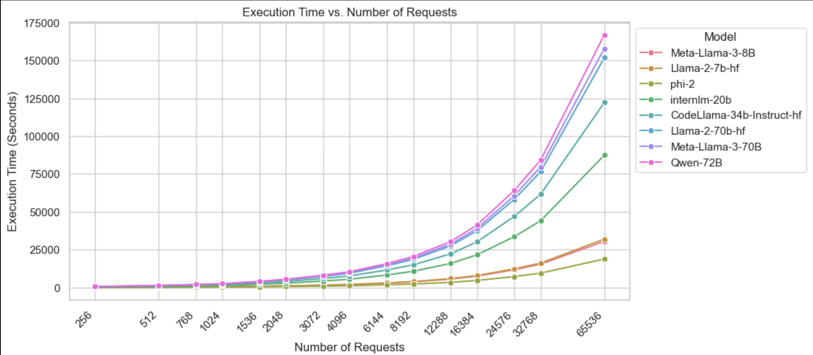
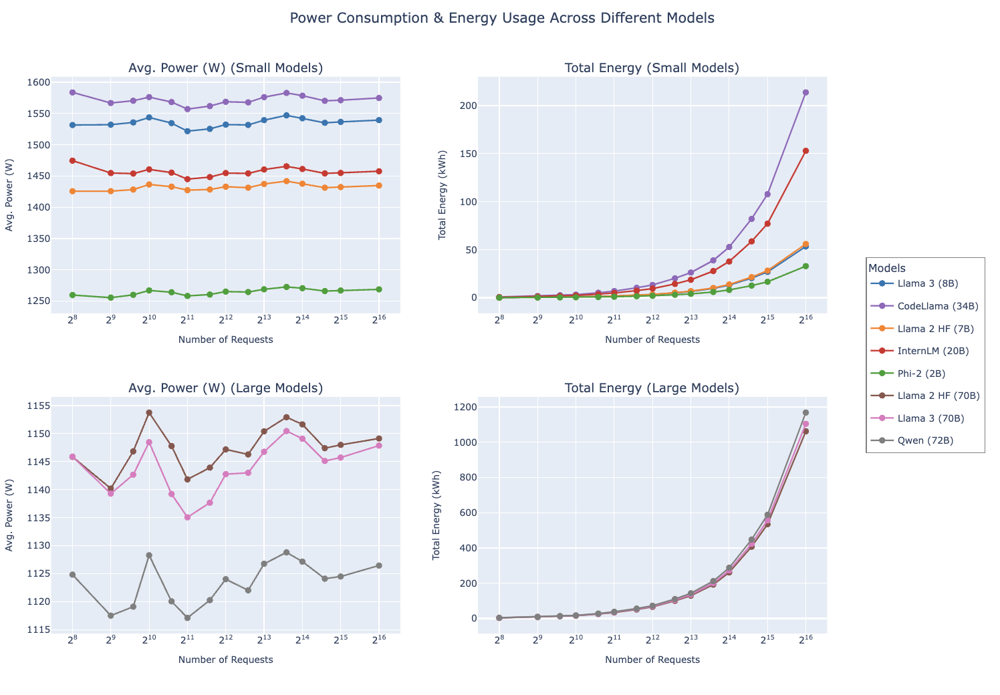
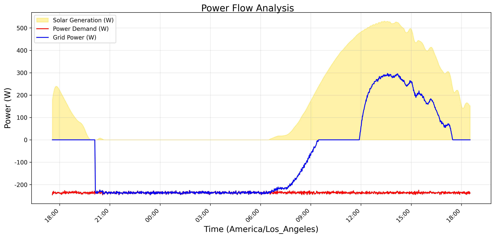
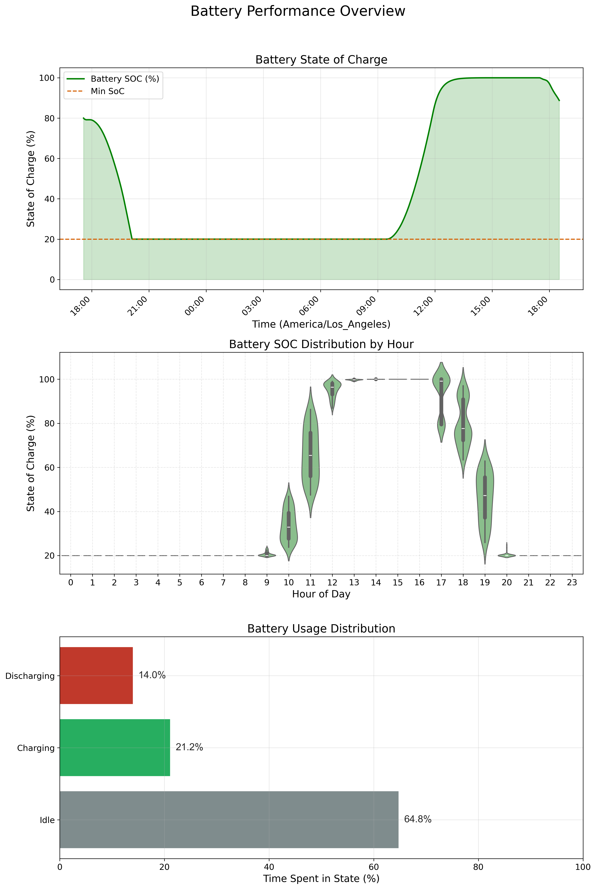
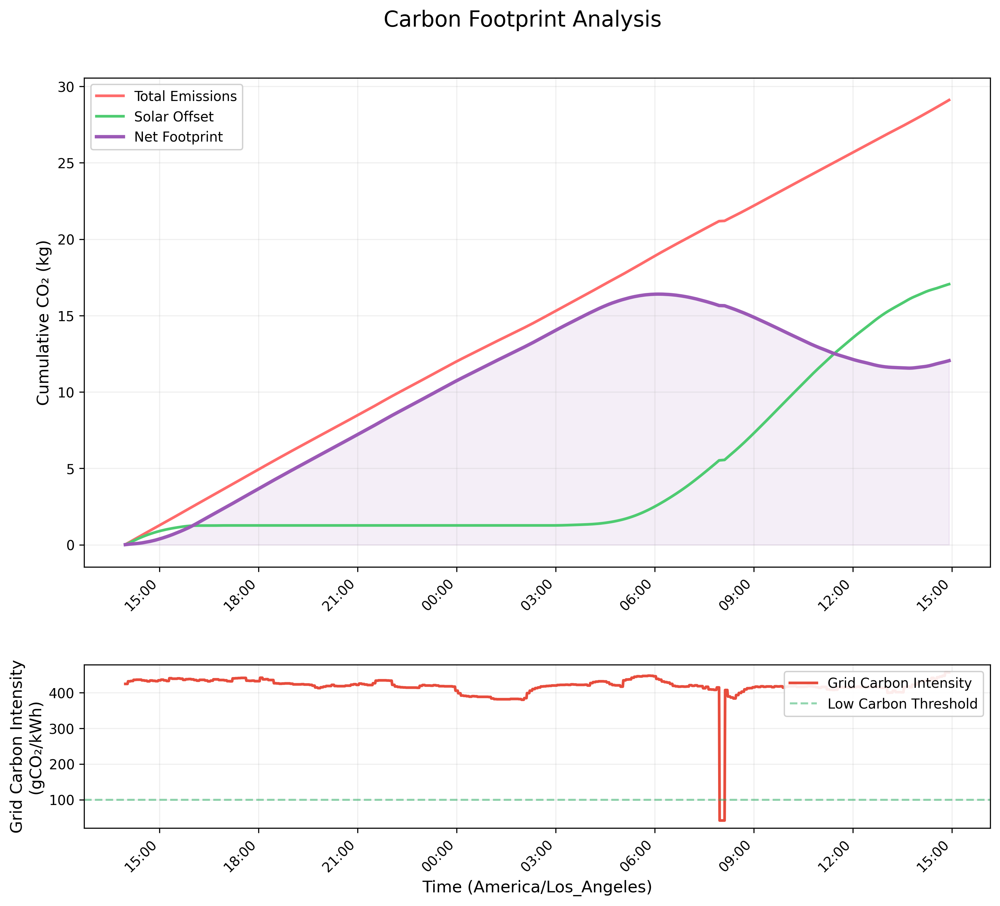

# 📗 **Vidur-Energy: Extending Vidur for Power and Energy Tracking**

📄 _This repository accompanies the paper:_  

**“Quantifying the Energy Consumption and Carbon Emissions of LLM Inference via Simulations”**  
_Miray Özcan @ Minerva University, California, USA | Philipp Wiesner, Philipp Weiß, Odej Kao @ Technische Universität Berlin, Germany_  

Vidur-Energy is an **enhanced version** of [Vidur](https://github.com/microsoft/vidur), a high-fidelity **LLM inference system simulator**, with **additional energy tracking capabilities**. This extension introduces:

⚡ **Power draw monitoring**  
🔋 **Energy consumption analysis**  
🌍 **Carbon emission estimation**

These features enable **more sustainable AI inference optimizations**. 🌱🌎

---

## 🌟 **Features**  

Vidur-Energy retains all core functionalities of Vidur while adding **new energy-aware insights**, such as:  

✅ **Power Tracking**: Extracts **GPU power draw** at different utilization levels.  
✅ **Energy Consumption Estimation**: Tracks **energy usage** across inference workloads.  
✅ **Carbon Footprint Estimation**: Uses **grid carbon intensity data** to estimate **inference-related emissions**.  
✅ **Modular Energy Tracking**: A more **configurable** and **extensible** approach to tracking energy metrics.  
✅ **Full Compatibility with Vidur**: All existing **simulation capabilities** remain **unchanged**.  

---

## 📥 **Cloning the Repo and Fetching Branches**

To access the full codebase including custom extensions:

```bash
# Clone the repo and navigate into it
git clone https://github.com/yourusername/vidur-energy.git
cd vidur-energy

# Fetch all remote branches
git fetch --all

# Create local branches to track remotes
git checkout -b energy-tracking origin/energy-tracking
git checkout -b vidur-vessim-basic origin/vidur-vessim-basic
```
---

## 🔧 **1. Setup**  

### 🐍 **Using `mamba` (Recommended)**  
```sh
mamba env create -p ./env -f ./environment.yml
mamba env update -f environment-dev.yml
```

### 🐍 **Using `venv`**  
```sh
python3.10 -m venv .venv
source .venv/bin/activate
python -m pip install -r requirements.txt
```

### 🐍 **Using `conda` (Least Recommended)**  
```sh
conda env create -p ./env -f ./environment.yml
conda env update -f environment-dev.yml
```

---

## 🚀 **2. Running the Simulator**

You can run Vidur in standalone mode for LLM inference simulations with or without energy tracking.

> ℹ️ **Need help with parameters?**  
> Run the following to view all configurable flags and their descriptions:  
> ```sh
> python -m vidur.main -h
> ```

---

### 🧪 **Running a Standard Simulation**

To execute a standard simulation (**without energy tracking**):  
```sh
python -m vidur.main
```

---

### 🔁 **Example: Synthetic Request Generator**
```sh
python -m vidur.main  \
--replica_config_device a100 \
--replica_config_model_name meta-llama/Llama-2-7b-hf \
--cluster_config_num_replicas 1 \
--replica_config_tensor_parallel_size 1 \
--replica_config_num_pipeline_stages 1 \
--request_generator_config_type synthetic \
--synthetic_request_generator_config_num_requests 400000 \
--length_generator_config_type zipf \
--interval_generator_config_type poisson \
--poisson_request_interval_generator_config_qps 20 \
--replica_scheduler_config_type vllm \
--vllm_scheduler_config_batch_size_cap 128 \
--vllm_scheduler_config_max_tokens_in_batch 4096 \
--metrics_config_store_utilization_metrics \
--execution_time_predictor_config_type random_forrest
```

---

### 📂 **Example: Trace-Based Simulation**
```sh
python -m vidur.main  \
--replica_config_device a100 \
--replica_config_model_name meta-llama/Meta-Llama-3-8B \
--cluster_config_num_replicas 1 \
--replica_config_tensor_parallel_size 1 \
--replica_config_num_pipeline_stages 1 \
--request_generator_config_type synthetic \
--synthetic_request_generator_config_num_requests 512  \
--length_generator_config_type trace \
--trace_request_length_generator_config_max_tokens 16384 \
--trace_request_length_generator_config_trace_file ./data/processed_traces/splitwise_conv.csv \
--interval_generator_config_type poisson \
--poisson_request_interval_generator_config_qps 6.45 \
--replica_scheduler_config_type sarathi  \
--sarathi_scheduler_config_batch_size_cap 512  \
--sarathi_scheduler_config_chunk_size 512 \
--random_forrest_execution_time_predictor_config_prediction_max_prefill_chunk_size 16384 \
--random_forrest_execution_time_predictor_config_prediction_max_batch_size 512 \
--random_forrest_execution_time_predictor_config_prediction_max_tokens_per_request 16384
```

---

## 🌿 **3. Energy Tracking in `energy-tracking` Branch**  

The `energy-tracking` branch introduces **power and energy-related analytics** within Vidur. This branch features:  

📊 **Energy-aware statistics extraction**  
📉 **A reporting module for power consumption, energy efficiency, and carbon footprint**  

### 🔄 **Changes in This Branch**  
- **New Scripts**:  
  - `stats_extractor_energy.py`: Extracts **power, energy, and carbon footprint** metrics.  
  - `stats_extractor_energy_reporting/`: Directory for **configurations and reporting tools**.  

- **Configuration Additions**:  
  - `config/gpu_configs.py`: Defines **power profiles** for different GPU models.  
  - `config/region_configs.py`: Provides **grid parameters** like carbon intensity, PUE, and electricity cost.  

### 🌱 **Running Energy Tracking & Analysis**  

#### 📊 **Extracting Energy Metrics from a Simulation**  
Let's assume the name of our simulation result subdirectory is 'vidur-results-demo.'
```sh
python -m vidur.config_optimizer.analyzer.stats_extractor_energy \
--sim-results-dir simulator_output/vidur-results-demo
```
📁 This generates an **`analysis/` subdirectory** containing energy usage statistics.  

#### 📄 **Generating Energy Reports**  
```sh
python -m vidur.config_optimizer.analyzer.stats_extractor_energy_reporting \
--sim-results-dir simulator_output/vidur-results-demo  \
--region california
```
This generates **visual reports** on:  
✅ **Power and energy usage over time**  
✅ **Carbon emissions impact per region**  
✅ **Model parallelism efficiency vs energy consumption**  
✅ **Comparative energy costs across regions**  

---

### 📊 Energy Consumption Reports

<div align="center">

<table>
  <tr>
    <td align="center" style="padding: 10px;">
      <strong>🌍 Sustainable AI Performance Metrics</strong><br>
      
    </td>
    <td align="center" style="padding: 10px;">
      <strong>📉 Energy Over Time & Efficiency</strong><br>
      
    </td>
    <td align="center" style="padding: 10px;">
      <strong>🌍 Regional Emissions & Cost</strong><br>
      
    </td>
  </tr>
</table>

</div>

---

## 🧪 **4. Replicating the Experiments in `experiments` Branch**  

This project includes a full set of scripted experiments that were used to generate the results in the accompanying paper:

📄 _“Towards Quantifying the Energy Consumption and Carbon Emissions of LLM Inference: A Simulation-Based Approach”_

These experiments evaluate:
- ⚡ **Power consumption** under different inference workloads
- ⏳ **Execution time** across varying request patterns and system configs
- 🌱 **Energy efficiency** tradeoffs for different models and deployment settings

---

### 📂 **Directory Structure**

All relevant files are in the `experiments-final/` directory, organized as follows:

- `experiments-final/scripts/`  
  Contains **fully executable Python scripts** for each experiment.  
  Example:  
  - `exp1-numrequests-power-energy.py`: Evaluates how increasing the number of requests impacts power usage and energy draw.  
  - `exp3-prefill-decode-ratio.py`: Analyzes tradeoffs across prefill/decode token ratio variations.  

- `experiments-final/analysis/`  
  Contains **Jupyter Notebooks** for post-processing, plotting, and deeper analysis.  
  Each notebook corresponds to an experiment script and renders visuals similar to those in the paper.  
  Example:  
  - `exp1-numrequests-power-energy.ipynb`: Plots power and efficiency results from the script above.

---

### 🔬 **How to Run the Experiments**

> 🛠️ Before running, ensure you have completed setup and are in the correct environment.

#### Step 1: Run a predefined experiment script  
Each script generates raw simulation outputs + energy tracking metadata.

```sh
python experiments-final/scripts/exp1-numrequests-power-energy.py
```

You can repeat this with other scripts in the same folder.

#### Step 2: Open the corresponding Jupyter notebook for analysis

```sh
jupyter notebook experiments-final/analysis/exp1-numrequests-power-energy.ipynb
```

This notebook:
- Loads the output directory automatically
- Plots power draw, GPU utilization, energy efficiency, and emissions metrics
- Compares across variations (e.g., model type, request volume, QPS)

#### Step 3: Adjust experiment parameters (optional)

Each script uses predefined simulation configurations, but you can modify:
- Model type (e.g., LLaMA-70B vs LLaMA-8B)
- Request generator parameters (e.g., QPS, length distribution)
- Parallelism settings
- Region for emissions comparison

Modify directly in the experiment script or use YAML configs in `configs/`.

---

### 📊 Visual Examples from the Paper’s Experiments

<div align="center">

<table>
  <tr>
    <td align="center" style="padding: 10px;">
      <strong>⚡ Power Consumption vs. Number of Requests</strong><br>
      
    </td>
    <td align="center" style="padding: 10px;">
      <strong>⏳ Execution Time vs. Number of Requests</strong><br>
      
    </td>
    <td align="center" style="padding: 10px;">
      <strong>🌱 Comparative Energy Efficiency Across Models</strong><br>
      
    </td>
  </tr>
</table>

</div>

---

## 🔋 **5. Vidur–Vessim Co-Simulation (`vidur-vessim-basic` Branch)**

The `vidur-vessim-basic` branch enables **carbon-aware inference simulations** by integrating the **Vidur LLM inference simulator** with **Vessim**, a testbed for modeling solar generation, battery dynamics, and regional carbon emissions.

This co-simulation pipeline lets you:
- 🔆 Simulate solar energy generation across locations  
- 🔋 Track battery charging, discharging, and SoC over time  
- 🌍 Evaluate the **carbon footprint** of LLM inference under different grid conditions  

---

### ⚙️ Environment Setup

Due to dependency mismatches (notably `numpy`), we recommend creating a **separate virtual environment** for this branch:

```bash
# Create and activate a new environment
python3 -m venv .venv-vessim
source .venv-vessim/bin/activate

# Install all required packages for this branch
pip install -r requirements.txt
```

Make sure to run your **Vidur simulation first** and then provide the path to the simulation output directory when running the co-simulation.

---

### 🌞 Running the Co-Simulation

You can launch the full Vidur–Vessim co-simulation pipeline using:

```bash
python -m vidur.vidur_vessim.cli \
--vidur-sim-dir simulator_output/vidur-vessim-example \
--location "San Francisco" \
--agg-freq 1min \
--analysis-type "trend analysis" \
--step-size 60 \
--solar-scale-factor 600 \
--battery-capacity 100 \
--battery-initial-soc 0.8 \
--battery-min-soc 0.2 \
--log-metrics \
--carbon-analysis \
--low-carbon-threshold 100 \
--high-carbon-threshold 200 \
--interpolate-datasets
```

This command processes your Vidur results, applies location-based solar and carbon data, and simulates how battery and emissions behave over time.

---

### 📘 View All CLI Options

To explore all configurable parameters, run:

```bash
python -m vidur.vidur_vessim.cli -h
```

---

### 🧾 CLI Argument Reference

| Flag | Description | Default |
|------|-------------|---------|
| `--vidur-sim-dir` | **(Required)** Path to Vidur’s simulation output (must contain MFU power data) | — |
| `--location` | Location for time zone and solar irradiance | `"San Francisco"` |
| `--agg-freq` | Aggregation frequency (e.g. `1min`, `5min`) | `"1min"` |
| `--analysis-type` | Type of simulation analysis (`trend analysis` or `total power analysis`) | `"trend analysis"` |
| `--step-size` | Simulation time resolution (in seconds) | `60` |
| `--solar-scale-factor` | Installed solar capacity in watts | `5000` |
| `--battery-capacity` | Battery size in watt-hours | `5000` |
| `--battery-initial-soc` | Initial battery state of charge (0.0 to 1.0) | `0.4` |
| `--battery-min-soc` | Minimum allowable SoC before cutoff | `0.3` |
| `--log-metrics` | Enables summary logging to `simulation_metrics.txt` | _(flag)_ |
| `--carbon-analysis` | Enables emissions computation | _(flag)_ |
| `--low-carbon-threshold` | gCO₂/kWh value considered "green" | `100` |
| `--high-carbon-threshold` | gCO₂/kWh value considered "dirty" | `200` |
| `--interpolate-datasets` | Aligns time series via cubic interpolation | _(flag)_ |

📍 **Allowed values for `--location`:**
```
Berlin, Cape Town, Hong Kong, Lagos, Mexico City,
Mumbai, San Francisco, Stockholm, Sydney, São Paulo
```

---

### 📊 Outputs & Visualizations

Results are saved in the `vessim_analysis/` subfolder inside your simulation output directory.

All key statistics are logged to:
```bash
vessim_analysis/simulation_metrics.txt
```

This file includes:
- ✅ Total energy demand  
- ✅ Grid vs. solar energy share  
- ✅ Carbon intensity over time  
- ✅ Battery SoC distribution and cycling behavior  

---

### 📈 Vessim Co-Simulation Visuals

<div align="center">

<table>
  <tr>
    <td align="center" style="padding: 12px; vertical-align: top;">
      <strong>🔄 Power Flow Analysis</strong><br>
      <br>
      <p style="margin-top: 8px; max-width: 240px;">Visualizes how solar, grid, and model power usage intersect.</p>
    </td>
    <td align="center" style="padding: 12px; vertical-align: top;">
      <strong>🔋 Battery Performance Overview</strong><br>
      <br>
      <p style="margin-top: 8px; max-width: 240px;">Shows SoC over time, hourly distribution, and usage state breakdown.</p>
    </td>
    <td align="center" style="padding: 12px; vertical-align: top;">
      <strong>🌍 Carbon Emissions Breakdown</strong><br>
      <br>
      <p style="margin-top: 8px; max-width: 240px;">Gross emissions, renewable offset, and net carbon footprint.</p>
    </td>
  </tr>
</table>

</div>


## 🔁 **6. Real-Time Co-Simulation (WIP: `vidur-vessim-realtime` Branch)**

We are actively working on enabling **real-time co-simulation** between Vidur and Vessim in the `vidur-vessim-realtime` branch.

Unlike earlier pipelines that treat Vidur’s power output as a **fixed input** to Vessim, this branch explores a **bidirectional feedback loop** where:

- ⚙️ **Vidur dynamically adapts inference parameters** (e.g., GPU allocation, batch size, throughput) in response to evolving energy availability and carbon intensity from Vessim.
- ⚡ **Vessim adjusts energy supply decisions** (e.g., switching between grid and solar, scheduling based on battery availability) based on Vidur’s workload.

This **tight integration** brings us closer to realistic datacenter scheduling and enables:
- ♻️ Adaptive inference during low-carbon windows  
- 🌍 Geo-aware routing of inference tasks to greener datacenters  
- ⏱️ Real-time control over system behavior in energy-constrained settings  

#### 🧪 Active Development Areas:
- Time-synchronized simulation clocks  
- Real-time state sharing across simulators  
- A flexible interface for modifying inference & energy parameters mid-run  

> 📢 **This work is in progress and open to contributions!**  
If you're interested in shaping the future of carbon-aware AI infrastructure, we’d love to collaborate.

➡️ Clone the branch:
```bash
git checkout -b vidur-vessim-realtime origin/vidur-vessim-realtime
```

Feel free to open issues, share ideas, or submit a pull request!

---

## 🧹 **7. Formatting Code**

To automatically format all code using standard style guidelines:

```bash
make format
```

---

## 🤝 **8. Contributing**

We welcome contributions of all kinds — from code and documentation to ideas and testing!

- 🔹 Fork the repository  
- 🔹 Create a new feature branch  
- 🔹 Submit a pull request for review  

Let us know if you'd like to be involved in real-time simulation, emissions modeling, or future experiment pipelines.

---

## 🙌 **9. Acknowledgments**

### 🌿 Built on Microsoft Research’s Vidur  
This project builds upon [**Vidur**](https://github.com/microsoft/vidur), a high-fidelity simulator of LLM inference. Our extensions aim to integrate sustainability as a **first-class metric** in inference workloads.

For more details, check out the **[Vidur paper (MLSys 2024)](https://arxiv.org/abs/2405.05465)**.

### ⚡ Powered by Vessim  
We leverage [**Vessim**](https://github.com/dos-group/vessim), a simulation framework from TU Berlin for modeling carbon-aware computing environments.

If Vessim helps your research, please cite:
> Wiesner et al. (2024). *Vessim: A Testbed for Carbon-Aware Applications and Systems.*

---

## 📜 **10. License**

This project follows the original **Vidur license**. See [`LICENSE`](./LICENSE) for details.

🚀 **Happy Sustainable AI Computing!** 🌱